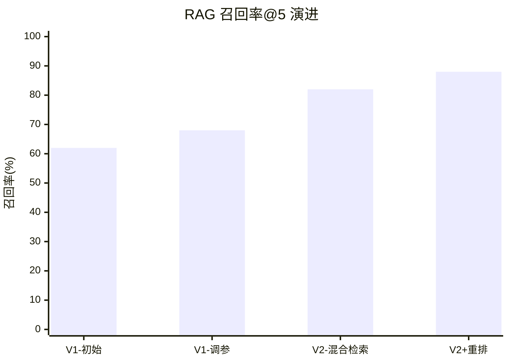

# 📊 评测历史（Bases 表视图）

## 全关评测总览

| 日期 | 关卡 | 项目 | 用例数 | 通过率 | LLM Judge一致率 | 成本(¥) | 版本 |
|---|---|---|---|---|---|---|---|
| 06-24 | ② AI编程协作 | spec-driven-todo | 15 | 93% | — | 0.00 | v1.0 |
| 07-01 | ③ Prompt资产 | 结构化日报生成器 | 20 | 85% | — | 0.00 | v1.0 |
| 07-12 | ④ RAG工程 | 企业知识库RAG | 30 | 待测 | — | — | v1.0 |
| — | ⑤ MCP | — | — | — | — | — | — |
| — | ⑥ Agent | — | — | — | — | — | — |
| — | ⑦ Evals上线 | — | 50+ | — | — | — | — |

## 评测趋势（第4关 RAG 专项）

## 红队/安全检查清单（第7关前置）

| 攻击类型 | 是否测试 | 结果 |
|---|---|---|
| 提示注入（直接） | ⬜ | — |
| 提示注入（间接/文档投毒） | ⬜ | — |
| 工具越权调用 | ⬜ | — |
| 数据泄露（RAG 引用泄露敏感信息） | ⬜ | — |
| 拒绝服务（超长输入） | ⬜ | — |
